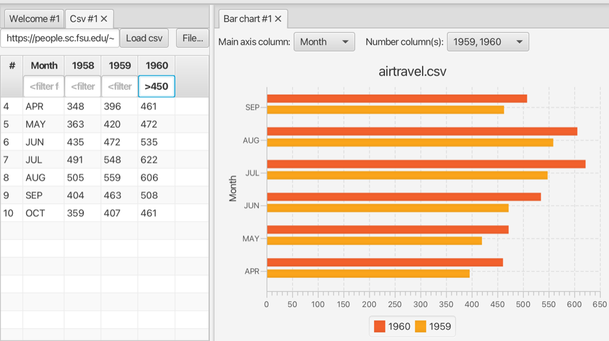

#### Stacked bar chart view

View data from a linked table as a bar chart.

Select the column that represents the main axis and numeric columns you want to show.

The screenshot shows airline data visualized as a bar chart. The original csv table has been filtered and (only) two of the columns are shown in the chart.

