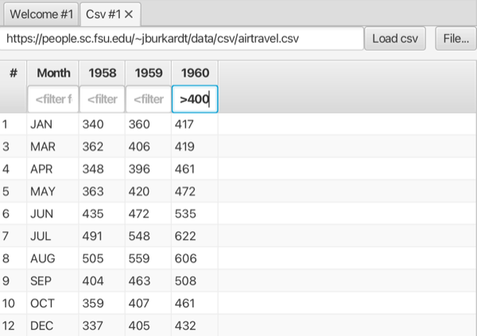

#### Csv view

Load data from a csv file, and view them in a table.

Enter the URI for the csv file and select **Load csv**, or browse to a local file.

The table supports filtering the columns with an expression. In the screenshot below, the user has loaded a csv file with airline data, and filtered the **1960** column to only show values **>400** (notice that the **FEB** and **NOV** rows are missing).

TODO: document filter expressions

The table can be the data source for other views.
