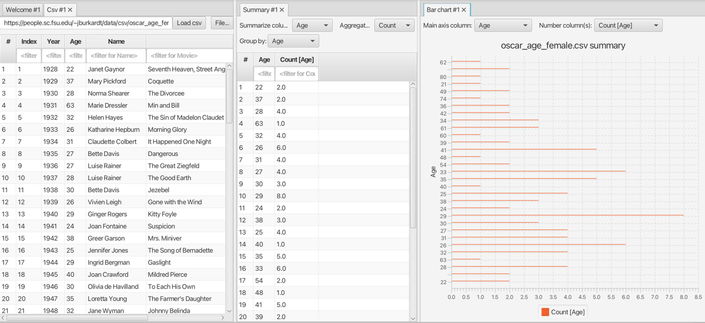

#### Summary view

This view is used for [summarizing(aggregating data)](https://jtablesaw.github.io/tablesaw/userguide/reducing.html) in a linked table.

Select the column in the linked table that you want to summarize, and select the aggregation function from the **Aggregate with** dropdown menu.

You can also group by a number of columns, select them in the **Group by** drowdown.

In the screenshot, table data from a csv view is summarized. For each age, it counts the number of female oscar winners. The result is visualized in a bar chart.

The summary table can be the data source for other views.
