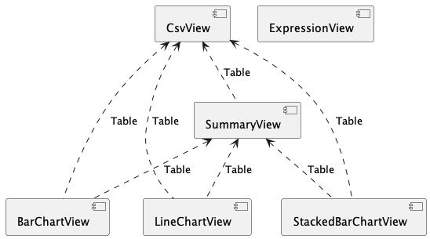

### Views

The **View** menu has entries for each kind of view, organized by category. Select an entry to create a new view.

Here are all the available views:

* [Welcome view](no.hal.wb.app.WelcomeView.md)

* [Csv view](no.hal.wb.app.CsvView.md) - load and view csv data

* [Bar chart view](no.hal.wb.app.BarChartView.md) - view table data as bar chart

* [Stacked bar chart view](no.hal.wb.app.StackedBarChartView.md) - view table data as stacked bar chart

* [Expression view](no.hal.wb.app.ExpressionView.md) - evaluate expressions

### Dependencies

Views may *provide* data to other views, alternatively a view my *require* data from other views. E.g. the [Csv view](no.hal.wb.app.CsvView.md) allows the user to load a csv file and show it as a **Table**, and this **Table** is made available or *provided* to other views. The [Bar chart view](no.hal.wb.app.BarChartView.md) on the other hand, *requires* a **Table**, and by linking it to the [Csv view](no.hal.wb.app.CsvView.md), it will use loaded csv data. We can say there's a provide/require-*dependency* among these two views.

The following diagram illustrates the provide/require-relationsships among the above views.

